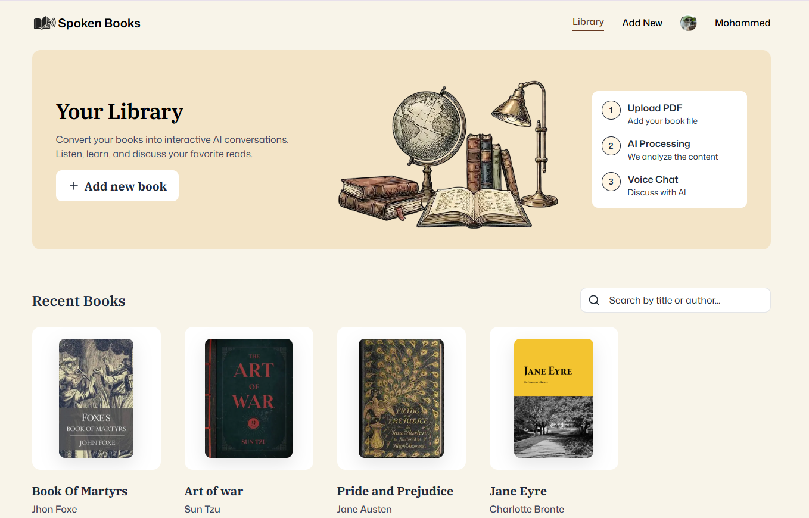
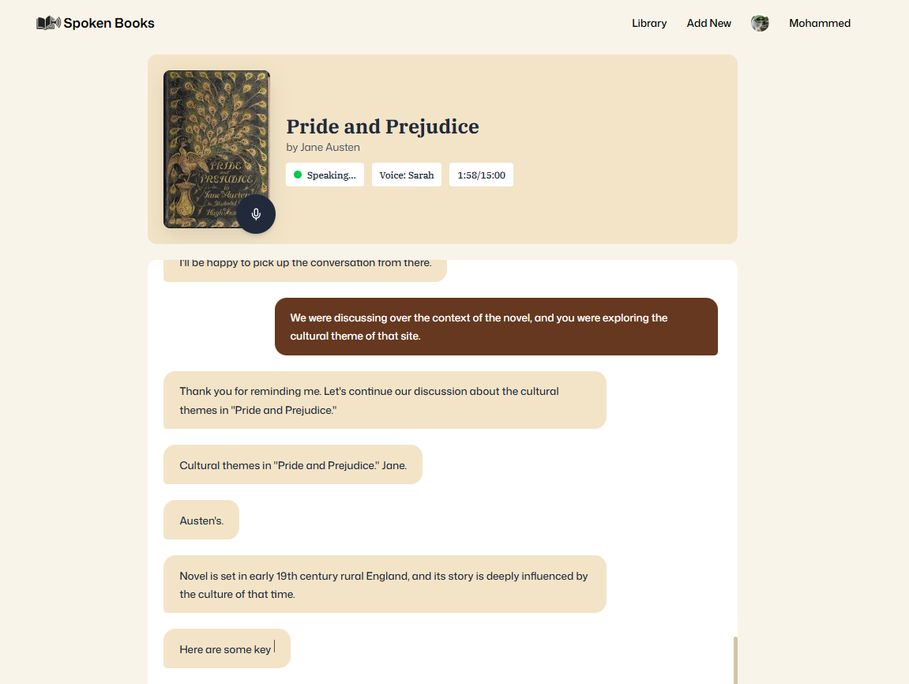

<div align="center">


# Spoken Books

**Transform your books into interactive AI voice conversations.**

Upload a PDF, and talk to an AI that has actually read it — out loud, in real time.

</div>

## Preview

<table>
  <tr>
    <td align="center" width="50%">
      <br/>
      <sub>Your library — recently added books</sub>
    </td>
    <td align="center" width="50%">
      <br/>
      <sub>Live voice conversation about a book</sub>
    </td>
  </tr>
</table>

## Overview

Spoken Books turns any book PDF into a voice-first study companion. Upload a book, and the app extracts and segments its text so an AI voice assistant can answer questions grounded in the actual content — not a generic summary. Every book gets its own persona and voice, and conversations happen as a real-time spoken call with a live transcript.

## Features

- **PDF upload with auto-processing** — drop in a PDF and the app extracts the text, generates a cover image, and splits the content into searchable segments.
- **Live voice conversations** — talk to an AI about the book using a real-time voice call, complete with a live, scrolling transcript.
- **Per-book persona & voice** — each book can be assigned its own ElevenLabs voice and conversational persona.
- **Grounded, retrieval-based answers** — the assistant looks up relevant passages from the book itself before answering, instead of relying purely on general knowledge.
- **Library & search** — browse recently added books and search your library by title or author.
- **Plan-based usage limits** — book count, monthly session count, and per-session duration are enforced per subscription plan.
- **Subscription billing** — Free / Standard / Pro plans managed through Clerk Billing.

## How it works

1. **Upload** — a PDF (and optional cover image) is uploaded from `/books/new` and stored in Vercel Blob.
2. **Process** — the PDF's text is extracted client-side and split into overlapping ~500-word segments for retrieval.
3. **Chat** — opening a book starts a live voice call (via Vapi) using that book's configured persona and voice.
4. **Ground** — during the conversation, the assistant calls back into this app's search endpoint to pull matching passages from the book before responding, keeping answers accurate to the source text.

## Tech stack

| Layer | Technology |
|---|---|
| Framework | Next.js 16 (App Router), React 19, TypeScript |
| UI | Tailwind CSS v4, shadcn/ui, lucide-react |
| Forms & validation | react-hook-form, zod |
| Auth & billing | Clerk (`@clerk/nextjs`) — authentication and subscription/Billing |
| Database | MongoDB with Mongoose |
| Voice AI | Vapi Web SDK (`@vapi-ai/web`) — handles speech-to-text, conversation, and ElevenLabs text-to-speech |
| File storage | Vercel Blob |
| PDF processing | pdfjs-dist |

## Getting started

### Prerequisites

- Node.js
- A MongoDB connection string (e.g. a free MongoDB Atlas cluster)
- A [Clerk](https://clerk.com) application, with Billing enabled and `standard`/`pro` plans configured
- A [Vercel Blob](https://vercel.com/docs/storage/vercel-blob) store
- A [Vapi](https://vapi.ai) account with an assistant configured to use an ElevenLabs voice

### Installation

```bash
git clone https://github.com/ancientphoenix34/Spoken-Pages.git
cd Spoken-Pages
npm install
```

### Environment variables

Create a `.env.local` file in the project root with the following variables:

| Variable | Purpose |
|---|---|
| `NEXT_PUBLIC_CLERK_PUBLISHABLE_KEY` | Clerk publishable key (client-side auth) |
| `CLERK_SECRET_KEY` | Clerk secret key (server-side auth) |
| `MONGODB_URI` | MongoDB connection string |
| `BLOB_STORE_ID` | Vercel Blob store identifier |
| `BLOB_READ_WRITE_TOKEN` | Vercel Blob read/write token |
| `NEXT_PUBLIC_ASSISTANT_ID` | Vapi assistant ID |
| `NEXT_PUBLIC_VAPI_API_KEY` | Vapi public API key |

### Run the dev server

```bash
npm run dev
```

Open [http://localhost:3000](http://localhost:3000).

## Project structure

```
app/
├── (root)/
│   ├── page.tsx               # Library home — search + recent books
│   ├── books/new/             # Upload a new book
│   ├── books/[slug]/          # Book detail & live voice chat
│   └── subscriptions/         # Clerk pricing table
└── api/
    ├── upload/                # Vercel Blob upload token handler
    └── vapi/search-book/      # Vapi tool webhook — grounded book search

components/                    # UI components (upload form, transcript, voice controls, etc.)
database/models/                # Book, BookSegment, VoiceSession (Mongoose)
lib/
├── actions/                   # Server actions (books, voice sessions)
├── subscription-constants.ts  # Plan limits
└── utils.ts                   # PDF parsing, text segmentation, helpers
hooks/                         # useVapi, useSubscription
```

## Subscription plans

| Plan | Max books | Sessions / month | Max minutes / session | Session history |
|---|---|---|---|---|
| Free | 1 | 5 | 5 | No |
| Standard | 10 | 100 | 15 | Yes |
| Pro | 100 | Unlimited | 60 | Yes |
